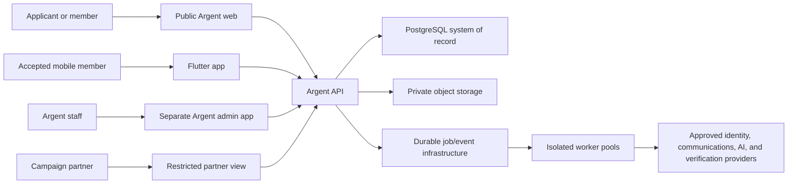
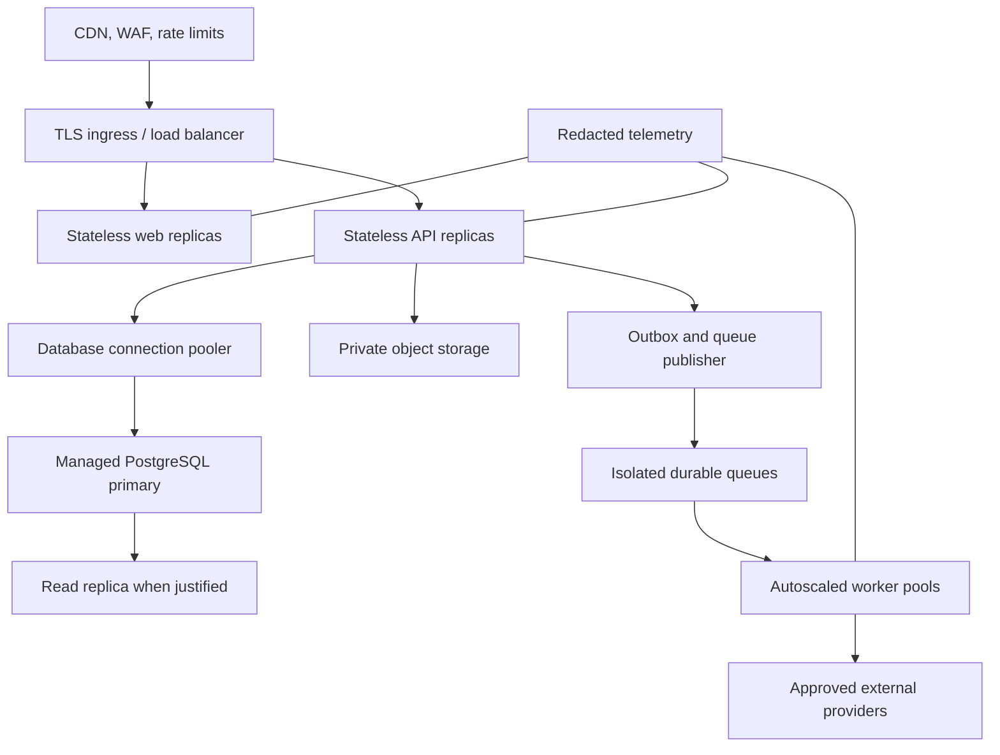

# Proposed Platform Architecture

## Status

This is a proposed baseline for review, not a final technology decision. Final choices require ADRs, prototypes where uncertainty is material, and security/operational review.

## Architectural approach

Start with a modular monolith plus independently scalable background workers. This keeps transactional rules, permissions, auditability, and delivery manageable while preserving clear domain boundaries. Extract services only when measured scale, isolation, or team ownership justifies it.

## System context



Authorization, consent, campaign scope, safety blocks, and deterministic eligibility are enforced before data enters provider or AI boundaries.

## Monorepo shape

```text
apps/
  web/              Public, applicant, and accepted-member web surface
  admin/            Separately deployed staff and owner admin application
  mobile/           Flutter iOS and Android application
services/
  api/              Versioned application API and domain modules
  worker/           Asynchronous jobs, notifications, AI, and integrations
packages/
  contracts/        OpenAPI/schema source and generated TypeScript/Dart clients
  database/         Server-only migrations, seed policy, and synthetic fixtures
  domain/           Server-only framework-light domain policy
  design-system/    Canonical tokens, generated web/Dart outputs, and web foundations
  config/           Shared lint, formatting, testing, and build configuration
infra/
  docker/           Development and production container definitions
  deployment/       Infrastructure-as-code and environment configuration
plans/              Canonical planning, tickets, ADRs, and checklists
```

Staff administration is a separate deployable application at `apps/admin`, not
a route area inside `apps/web`. This preserves independent deployment, a
dedicated future authentication/authorization boundary, and an operational UX
that is not exposed through public navigation. It does not replace server-side
role enforcement; that remains required before any production access.

Client-safe packages may contain generated contracts, public validation schemas, and design tokens. Authorization rules, sensitive matchmaking policy, provider credentials, and server domain logic must never be shipped in web or mobile bundles.

The design system uses one human-readable, vendor-neutral canonical token source. CI generates semantic CSS variables for web, typed Dart values and theme extensions for Flutter, and Figma-compatible variables. Public, operational, iOS, and Android surfaces consume the same semantic names while platform adapters preserve native navigation, input, safe-area, text-scaling, and accessibility behavior. Generated artifacts are not hand-edited; token drift and stale outputs should fail CI. See [design-system.md](design-system.md).

## Proposed technology baseline

- Web: TypeScript and a server-rendered React framework.
- Mobile: Flutter/Dart with generated API contracts.
- API/worker: TypeScript runtime with explicit modules and OpenAPI.
- Primary database: PostgreSQL with PostGIS for approved geographic rules.
- Search: PostgreSQL full-text and indexed filters first; add a search service only when measured needs justify it.
- Vector retrieval: pgvector may support bounded similarity use cases; it must not become the source of truth.
- Cache/queues: Redis-compatible infrastructure or a durable managed queue selected through ADR.
- Files: private S3-compatible object storage using short-lived signed access.
- Email/SMS/push: vetted providers behind internal ports with consent and delivery tracking.
- Identity/verification/screening: vetted providers; do not build these primitives from scratch.

## Domain modules

- Identity and access
- People and profiles
- Applications and admission
- Campaigns and attribution
- Consent and privacy rights
- Verification and safety
- Matchmaking and shortlists
- Introductions and outcomes
- Communications and preferences
- AI assistance and evaluations
- Billing/services (deferred unless MVP business model requires it)
- Audit and administration

Modules own their invariants. Cross-module workflows use explicit application services and durable events rather than direct table coupling.

## API and contract strategy

- Versioned HTTPS API with OpenAPI as the client contract.
- Generated Dart and TypeScript clients to prevent mobile/web drift.
- Contract-diff CI that rejects unapproved breaking changes and generated-client drift.
- Additive evolution by default; unknown enum values and fields must degrade safely.
- Defined mobile support/deprecation window, minimum-version policy, and capability negotiation.
- Idempotency keys for submissions, invitations, introductions, payments, and provider callbacks.
- Cursor pagination and bounded filters for large datasets.
- Structured error codes with safe user messages and internal correlation IDs.
- Signed, verified webhooks with replay protection.
- No sensitive fields in URLs.

## Synchronous versus asynchronous work

Synchronous:

- authentication and authorization;
- profile reads and safe edits;
- application state transitions;
- consent changes;
- shortlist and introduction decisions.

Asynchronous:

- media processing and malware scanning;
- email, SMS, and push delivery;
- AI analysis and evaluations;
- imports/exports;
- verification-provider reconciliation;
- retention and deletion workflows;
- aggregate reporting.

Jobs require idempotency, retry policy, dead-letter handling, audit events, and operator recovery.

Domain mutations that emit events use a transactional outbox. Incoming webhooks and replayable commands use an inbox/receipt record with verified signature, deduplication, occurrence/receipt times, and reconciliation state. Delivery is at-least-once; consumers must be idempotent. Ordering guarantees are explicit and limited to the smallest required aggregate.

The initial implementation keeps these durable identities in PostgreSQL. An
outbox row is inserted by the same transaction as its source mutation.
Dispatchers claim bounded batches with `FOR UPDATE SKIP LOCKED` and expiring
leases. Provider integrations verify signatures before storing a normalized
receipt and deduplicate by provider event ID plus canonical payload hash. The
job registry reserves idempotent work identity; queue execution and
dead-letter behavior remain a separate worker-foundation decision. See
[ADR-012](adrs/ADR-012-transactional-event-delivery.md).

Worker classes are isolated by risk and SLO:

| Queue class | Examples | Special controls |
| --- | --- | --- |
| Privacy | withdrawal, deletion, export | highest priority, restricted data, reconciliation |
| Safety/verification | provider callbacks, escalation | restricted access, short retry window, operator queue |
| Media | scan, strip metadata, transform | quarantine before availability |
| Notifications | email, SMS, push | consent check at send time, minimal payload |
| AI | summaries and suggestions | budget, model kill switch, input classification |
| Reporting | aggregates and exports | low priority, bounded queries, export approval |

## Docker and environments

Containerize web, API, worker, migrations, and local supporting services. Mobile binaries are built through signed Apple/Google pipelines, not deployed as containers.

Production images require multi-stage builds, pinned minimal bases, non-root users, read-only filesystems where practical, health/readiness checks, graceful shutdown, explicit resource limits, SBOMs, provenance/signing, and enforced vulnerability policy. Database migrations run as a singleton, backward-compatible release step with rehearsed failure recovery.

Required environments:

- local development;
- ephemeral/preview where safe;
- shared staging with synthetic data;
- production with strict access and change controls.

Production should prefer managed stateful services while retaining portable application containers.

## Proposed production topology



The deployment ADR must define network boundaries, workload identities, ingress rules, multi-availability-zone expectations, database connection budgets, migration ownership, production provisioning, and rollback responsibility.

## Scaling strategy

- Stateless web/API replicas behind a load balancer.
- Independent worker pools by queue and workload sensitivity.
- Connection pooling and tested database limits.
- Read replicas or specialized search only after profiling.
- Direct-to-object-storage uploads with size/type limits and asynchronous scanning.
- Backpressure, quotas, and circuit breakers around AI and external providers.
- Regional expansion only after data residency and operational requirements are decided.
- Scaling triggers based on latency, saturation, queue age/depth, database connections, storage throughput, provider throttling, and cost budgets.
- Documented beta capacity envelope and graceful-degradation order before staging approval.

## Observability

- Structured logs with redaction and correlation IDs.
- Metrics for latency, errors, queue depth, provider health, database saturation, and business-critical transitions.
- Distributed traces across API, jobs, and providers where proportionate.
- Security and audit events stored separately from general application logs.
- Alerts tied to runbooks and named owners.

## Architecture decisions required

- Web/API framework and runtime.
- Monorepo tooling that supports TypeScript and Flutter without forcing one ecosystem.
- Queue technology and delivery semantics.
- Authentication and identity provider.
- Cloud/deployment target and infrastructure-as-code tool.
- Object storage, malware scanning, and media transformation.
- Notification providers.
- Verification/background-screening providers.
- Staff web separation.
- Analytics architecture and privacy constraints.
- API/mobile compatibility policy.
- Transactional outbox/inbox and event delivery semantics.
- Server-only versus client-safe package boundary.
- Production topology and capacity/SLO policy.
- AI workflow/tool and authorization boundary.
- Canonical cross-platform design-token format, generation, and drift governance.
